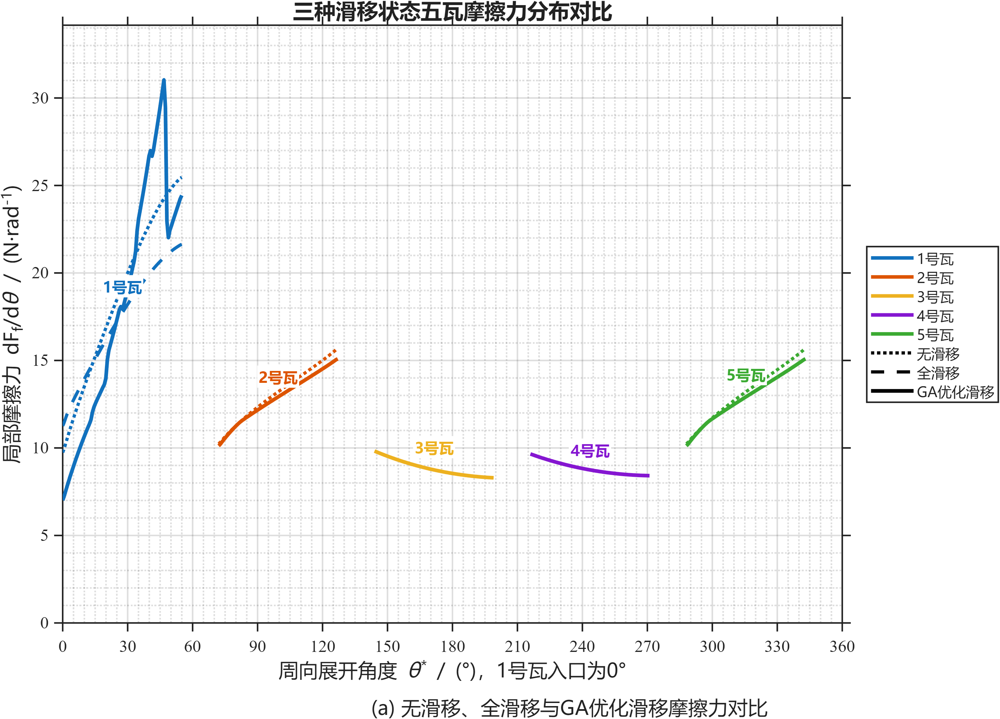
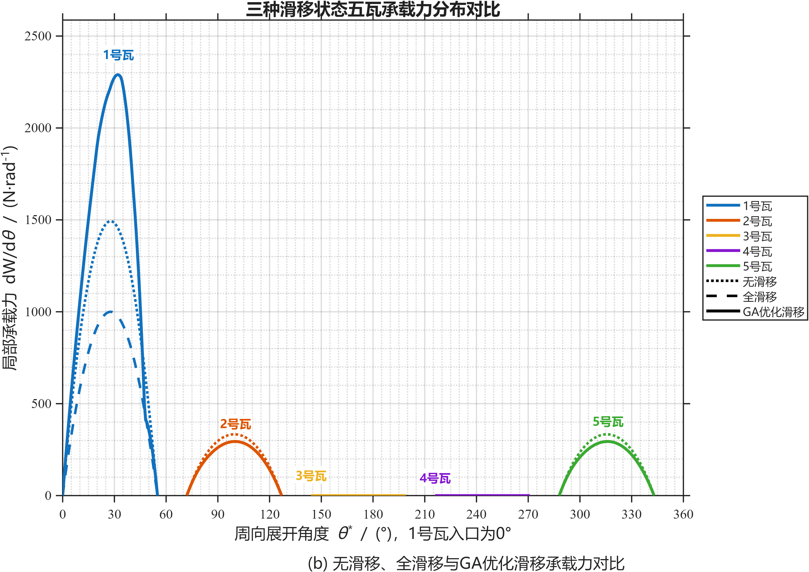

# Five-Pad TPJB Boundary Slip

基于 MATLAB 的五瓦可倾瓦径向轴承（Tilting-Pad Journal Bearing，TPJB）边界滑移数值研究程序。项目比较无滑移、五瓦全滑移和主承载瓦滑移区域遗传算法优化三种情况，并分析边界滑移对油膜压力、油膜厚度、摩擦力和承载力分布的影响。

## 研究内容

- 建立五瓦可倾瓦径向轴承稳态流体动力润滑模型；
- 采用有限差分法离散 Reynolds 方程；
- 采用逐次超松弛（SOR）方法求解油膜压力；
- 使用非负压力截断处理空化区域；
- 使用临界剪应力与滑移长度构成的二元边界滑移模型；
- 分别计算无滑移和五瓦全滑移工况；
- 使用遗传算法优化主承载瓦的滑移/无滑移区域；
- 比较三种工况下的摩擦力和承载力分布。

> 本项目研究的是固液界面的 **边界滑移（boundary slip）**，不是粗糙峰接触主导的边界润滑（boundary lubrication）。

## 主要程序

| 文件 | 功能 |
|---|---|
| `TPJB_NoSlip_5Pad.m` | 五瓦无滑移基准模型 |
| `TPJB_BinarySlip_5Pad.m` | 五瓦二元边界滑移模型 |
| `TPJB_GA_Optimize_MainPad.m` | 主承载瓦滑移区域遗传算法优化 |
| `run_ga_balanced.m` | GA优化启动脚本 |
| `TPJB_Friction_Comparison.m` | 无滑移、全滑移和GA优化滑移三种工况的摩擦力与承载力对比 |

## 数值模型

当前程序采用以下基本假设：

- 稳态、等温、不可压缩牛顿流体；
- 五块刚性瓦和刚性轴颈；
- 不考虑热变形、弹性变形、湍流和表面粗糙度；
- 轴颈表面采用无滑移边界；
- 指定瓦面具备边界滑移能力；
- 当局部壁面剪应力超过临界剪应力时触发滑移；
- 各瓦压力场由有限差分法和SOR迭代获得；
- 负压节点直接截断为环境表压。

二元边界滑移模型写为：

$$
u_s=
\begin{cases}
0, & |\tau_w|\leq\tau_c,\\
\dfrac{b}{\mu}\left(|\tau_w|-\tau_c\right)\operatorname{sgn}(\tau_w),
& |\tau_w|>\tau_c.
\end{cases}
$$

其中，$b$ 为滑移长度，$\tau_c$ 为临界剪应力，$\mu$ 为动力黏度。

## 运行方法

将 MATLAB 当前文件夹切换到项目根目录，然后按需要运行：

```matlab
% 无滑移计算
TPJB_NoSlip_5Pad

% 五瓦全滑移计算
TPJB_BinarySlip_5Pad

% 主承载瓦滑移区域GA优化
run_ga_balanced

% 三种工况摩擦力与承载力对比
TPJB_Friction_Comparison
```

建议先运行无滑移和全滑移模型，再执行GA优化和三工况对比。GA对比程序会读取 `GA_Optimization_Results` 中保存的优化结果。

## 输出结果

`GA_Optimization_Results` 文件夹包含：

- GA收敛过程；
- 优化后的主承载瓦滑移区域；
- 实际触发滑移区域；
- 油膜压力分布；
- 油膜厚度分布；
- 摩擦力分布；
- 承载力分布；
- MATLAB结果数据与CSV性能汇总。

## 三种工况对比结果

以下曲线比较无滑移、五瓦全滑移和GA优化滑移三种情况。不同颜色表示不同瓦块，不同线型表示不同边界条件。

### 摩擦力分布



### 承载力分布


